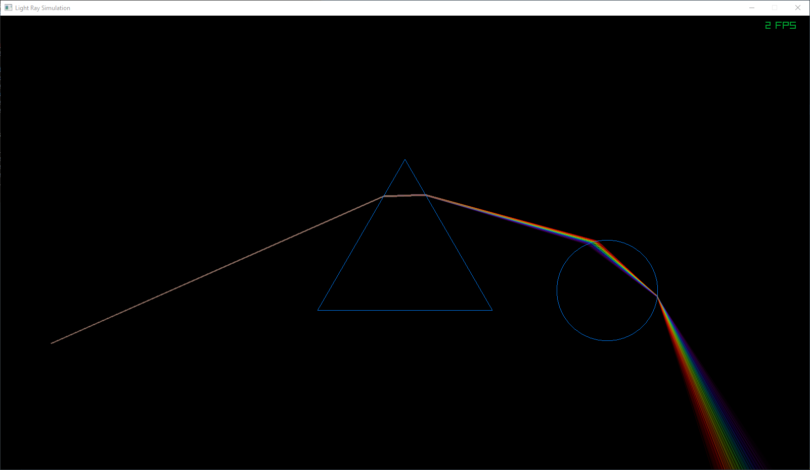

# 2dRaytracer

Simulates the refraction of light using Snell's law aswell as dispersion using Cauchy's equation.  
Written in c++ using raylib.  

# Features  
- light ray simulation
- drawing of different wavelengths
- reflective and refractive surfaces (or a mixture of both)
- supports cauchy eqautions as surface property
- adding of circles and triangles as shapes for light to pass through or reflect from
- adding and positioning directional light source

## Images 

Normal glass:

Unrealistic glass dispersion effect is much stronger:
